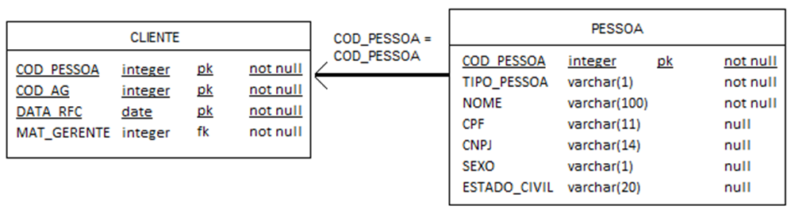

# Teste - Mairon Duarte Costa
## **Introdução do projeto**

Esse projeto é a junção dos dois testes ( teste_excel, teste_sql_perguntas_(1) ), fiz o teste de word/sql de forma que seja possível executar as suas etapas.

## **Arquitetura do projeto**



## **Pré-requisitos**

Para esse projeto foi utilizado o SQL-Server, para a execução da pasta **src/** tenha o **SQL Server Management Studio 20** instalado.

1. Clone esse repositorio

```bash

git clone https://github.com/Mairondc21/teste_Mairon.git
```
2. Abra o SQL Server Management Studio

3. Execute a primeira linha src/create_table.sql, Certifique-se de Criar também o Database mercantil

```sql
CREATE DATABASE mercantil;
```
4. Execute o resto do arquivo
```sql
USE mercantil;
CREATE TABLE PESSOA (
    COD_PESSOA INT PRIMARY KEY NOT NULL,
    TIPO_PESSOA VARCHAR(1) NOT NULL,
    NOME VARCHAR(100) NOT NULL,
    CPF VARCHAR(11) NULL,
    CNPJ VARCHAR(14) NULL,
    SEXO VARCHAR(1) NULL,
    ESTADO_CIVIL VARCHAR(20) NULL
);

CREATE TABLE CLIENTE (
    COD_PESSOA INT NOT NULL,
    COD_AG INT NOT NULL,
    DATA_RFC DATE NOT NULL,
    MAT_GERENTE INT NOT NULL,
    PRIMARY KEY (COD_PESSOA, COD_AG, DATA_RFC),
    FOREIGN KEY (COD_PESSOA) REFERENCES PESSOA(COD_PESSOA)
);

INSERT INTO PESSOA (COD_PESSOA, TIPO_PESSOA, NOME, CPF, CNPJ, SEXO, ESTADO_CIVIL) VALUES
(1, 'F', 'Maria Silva', '12345678901', NULL, 'F', 'Solteira'),
(2, 'F', 'João Souza', '09876543210', NULL, 'M', 'Casado'),
(3, 'J', 'Empresa XYZ Ltda', NULL, '12345678000199', NULL, NULL),
(4, 'F', 'Mario Costa Silva', '55687700468',NULL ,'M', 'Casado'),
(5, 'F', 'Lanna Maria', '65429733365', NULL, 'F', 'Viuva');

INSERT INTO CLIENTE (COD_PESSOA, COD_AG, DATA_RFC, MAT_GERENTE) VALUES
(1, 101, '2022-03-10', 201),
(2, 102, '2023-03-10', 202),
(1, 103, '2022-06-01', 203),
(3, 105, '2022-01-01', 204),
(4, 105, '2022-01-01', 205);
```

5. Execute o arquivo src/respostas.sql - Não precisa executar a 1) pergunta

```sql
--2) Selecione o CPF, o NOME e o SEXO de todas as pessoas físicas (TIPO_PESSOA = ‘F’) que tenha o nome ‘SILVA’.
SELECT 
	CPF,
	NOME,
	SEXO
FROM dbo.PESSOA
WHERE TIPO_PESSOA = 'F' AND NOME LIKE '%SILVA%';

-- 3)Atualize o campo MAT_GERENTE da tabela CLIENTE para 99999, onde a data de referência (DATA_RFC) for menor que ‘2022-04-01’.

UPDATE dbo.CLIENTE
SET MAT_GERENTE = 99999
WHERE DATA_RFC < '2022-04-01';


-- 4) Mostre a quantidade de clientes (COD_PESSOA) que cada gerente (MAT_GERENTE) possui na data de referência = ‘2022-06-01’. 

SELECT
	c.DATA_RFC,
	c.MAT_GERENTE,
	COUNT(c.COD_PESSOA)OVER (PARTITION BY c.MAT_GERENTE)AS QTD_CLIENTE
FROM dbo.CLIENTE c
LEFT JOIN dbo.PESSOA p ON c.COD_PESSOA = p.COD_PESSOA
WHERE DATA_RFC = '2022-06-01';


-- 5) Selecione a quantidade de clientes pessoa jurídica (TIPO_PESSOA = ‘J’) da agência 105 (COD_AG = 105), com data de referência = ‘2022-01-01’ Campos: DATA_RFC, COD_AG, QTD_PESSOA

SELECT
	c.DATA_RFC,
    c.COD_AG,
	COUNT(c.COD_PESSOA) AS QTD_CLIENTE
FROM dbo.CLIENTE c
INNER JOIN dbo.PESSOA p ON c.COD_PESSOA = p.COD_PESSOA
WHERE p.TIPO_PESSOA = 'J' AND c.COD_AG = 105 AND c.DATA_RFC = '2022-01-01'
GROUP BY c.DATA_RFC,c.COD_AG;

-- 6) Selecione o gerente (MAT_GERENTE) que possui a maior média de clientes (COD_PESSOA) durante todo o período analisado.

WITH count_qtd_cliente AS (
    SELECT
        c.MAT_GERENTE,
        COUNT(c.COD_PESSOA) AS QTD_CLIENTE
    FROM dbo.CLIENTE c
    LEFT JOIN dbo.PESSOA p ON c.COD_PESSOA = p.COD_PESSOA
    GROUP BY c.MAT_GERENTE
),
media_gerentes AS (
    SELECT 
        MAT_GERENTE,
        AVG(QTD_CLIENTE) AS MEDIA_QTD_CLIENTE
    FROM count_qtd_cliente
    GROUP BY MAT_GERENTE
)
SELECT TOP 1 MAT_GERENTE,MEDIA_QTD_CLIENTE
FROM media_gerentes
ORDER BY MEDIA_QTD_CLIENTE DESC;

-- 7) Mostre a quantidade de clientes (COD_PESSOA) que cada gerente (MAT_GERENTE) possui, em cada uma das datas de referência (DATA_RFC) selecionando apenas o sexo feminino (SEXO = ‘F’)

SELECT
	c.MAT_GERENTE,
	c.DATA_RFC,
	COUNT(c.COD_PESSOA) OVER (PARTITION BY c.MAT_GERENTE,c.DATA_RFC) AS QTD_CLIENTE
FROM dbo.CLIENTE c
LEFT JOIN dbo.PESSOA p ON c.COD_PESSOA = p.COD_PESSOA
WHERE p.SEXO = 'F'


-- 8) Selecione os gerentes (MAT_GERENTE) que possuem ao menos uma cliente com o NOME ‘MARIA’

SELECT
	c.MAT_GERENTE,
	COUNT(c.COD_PESSOA) AS QTD_CLIENTE,
	p.NOME
FROM dbo.CLIENTE c
INNER JOIN dbo.PESSOA p ON c.COD_PESSOA = p.COD_PESSOA
WHERE p.NOME LIKE '%Maria%'
GROUP BY c.MAT_GERENTE,p.NOME

-- 9) Selecione todas as pessoas (COD_PESSOA) que não estão na tabela CLIENTE.

SELECT
	p.COD_PESSOA,
	p.TIPO_PESSOA,
	p.NOME,
	p.CNPJ,
	p.SEXO,
	p.ESTADO_CIVIL
FROM dbo.PESSOA p
LEFT JOIN dbo.CLIENTE c ON c.COD_PESSOA = p.COD_PESSOA
WHERE c.COD_PESSOA IS NULL

--10) Selecione a agência (COD_AG) que possui a maior quantidade de mulheres (SEXO = ‘F’) na última data de referência disponível.

WITH qtd_cod_ag AS( 
	SELECT
		c.COD_AG,
		c.DATA_RFC,
		COUNT(c.COD_PESSOA) AS QTD_CLIENTE,
		p.NOME
	FROM dbo.CLIENTE c
	INNER JOIN dbo.PESSOA p ON c.COD_PESSOA = p.COD_PESSOA
	WHERE p.SEXO = 'F'
	GROUP BY c.COD_AG,p.NOME,c.DATA_RFC
),
ultima_data AS (
	SELECT TOP 1
		*
	FROM qtd_cod_ag
	ORDER BY DATA_RFC DESC
)
SELECT 
	* 
FROM ultima_data
```

## **Observação**
Execute a src/respostas.sql uma questão por vez, e em sequencia